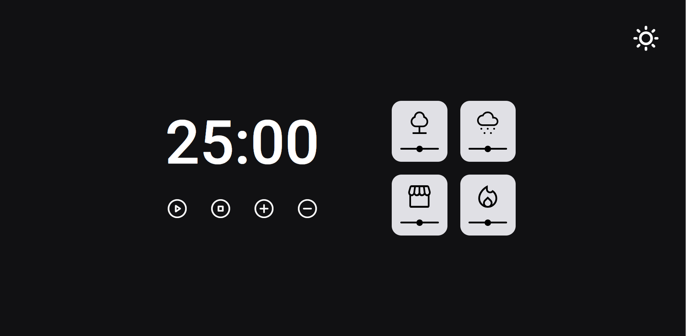

  

## 💻 Projeto

O Focus Timer, é um sistema para aplicação da técnica de pomodoro, podendo acrescentar ou diminuir 5 minutos pelo botões de controles mais e menos.
Também é possível habilitar sons ambientes para relaxar a manter o foco e também alterando para o modo dark ou light.

## 🚀 Tecnologias

Esse projeto foi desenvolvido com as seguintes tecnologias:

- HTML
- CSS
- Javascript
- Git e Github

## 🏷️ Layout

Você pode visualizar o layout do projeto através
[desse link](<https://www.figma.com/file/38f3W6f9UL8nZsQIZ95jMn/Stage-05---Dark-Mode-FocusTimer-(Copy)?type=design&node-id=2%3A2&mode=design&t=Tis0ysjOeR0Nre0G-1>)
É necessário ter uma conta no [Figma](https://www.figma.com)

Desenvolvido por [Gabriel-George](https://www.linkedin.com/in/gabrielgeorgesilva/)